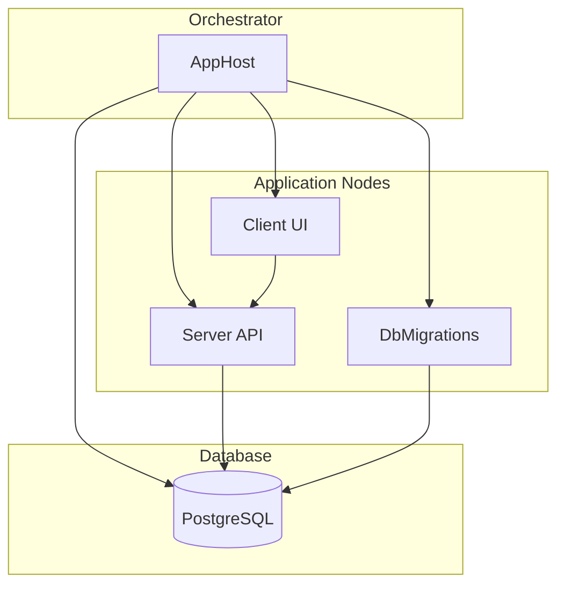

# RandomFortuneApp

RandomFortuneApp is a distributed .NET solution that provides random fortune messages via a server API, a Blazor/Razor client UI, and automated database migrations and seeding. It is composed of several projects that work together to deliver and manage fortunes stored in a PostgreSQL database.

## Prerequisites
This repository comes ready for use with GitHub Codespaces. You can open the project up in an interactive, browser-based code editor by clicking this button. 

[](https://github.com/bradygaster/RandomFortuneApp)

To work with .NET Aspire locally, you need the following installed:

- .NET 8.0 or .NET 9.0.
- An OCI compliant container runtime, such as Docker Desktop or Podman.

Then you can build Aspire apps using your favorite Integrated Developer Environment (IDE) or code editor, such as:

- Visual Studio 2022 version 17.9 or higher (Optional)
- Visual Studio Code (Optional)
- C# Dev Kit: Extension (Optional)
- JetBrains Rider with .NET Aspire plugin (Optional)



### AppHost
| File                              | Purpose                                                                              |
| --------------------------------- | ------------------------------------------------------------------------------------ |
| `AppHost.csproj`                  | Defines the orchestrator project that coordinates all services                       |
| `Program.cs`                      | Builds and runs the distributed application, defining service dependencies           |

### Server
| File                              | Purpose                                                                              |
| --------------------------------- | ------------------------------------------------------------------------------------ |
| `Server.csproj`                   | Defines the Web API project for serving fortunes                                     |
| `Program.cs`                      | Hosts the API endpoints and configures middleware                                    |

### Client
| File                              | Purpose                                                                              |
| --------------------------------- | ------------------------------------------------------------------------------------ |
| `Client.csproj`                   | Defines the Blazor/Razor client UI project                                           |
| `Program.cs`                      | Bootstraps the client application and DI services                                     |
| `FortuneApiClient.cs`             | HTTP client service that calls the Server API                                        |
| `Pages/Index.cshtml`              | Main UI page displaying fortunes                                                      |
| `Pages/Index.cshtml.cs`           | Code-behind for the Index page model                                                 |

### Data
| File                              | Purpose                                                                              |
| --------------------------------- | ------------------------------------------------------------------------------------ |
| `Data.csproj`                     | Defines the Entity Framework Core context project                                     |
| `FortuneDbContext.cs`             | EF Core `DbContext` defining the `Fortunes` DbSet                                     |
| `Migrations/`                     | Contains EF Core migration files (schema creation)                                    |

### DbMigrations
| File                              | Purpose                                                                              |
| --------------------------------- | ------------------------------------------------------------------------------------ |
| `DbMigrations.csproj`             | Defines the database migration and seeding project                                     |
| `Program.cs`                      | Entry point to apply migrations and seed data                                         |
| `DatabaseSeeder.cs`               | Seeds initial fortune data into the database                                          |
| `Worker.cs`                       | Background service that runs migrations and invokes the seeder                        |

### ServiceDefaults
| File                              | Purpose                                                                              |
| --------------------------------- | ------------------------------------------------------------------------------------ |
| `ServiceDefaults.csproj`          | Defines shared service configuration defaults                                          |
| `Extensions.cs`                   | Extension methods applying default service setup (logging, metrics, etc.)             |

## Running the Application

From the solution root directory, run the orchestrator which will build, migrate the database, and start all services:

```powershell
# Run the orchestrator (migrations, API, client)
dotnet run --project .\AppHost\AppHost.csproj
```

Open your browser to  the port displayed in the console to view the Aspire dashboard. Once all the projects are up and running (green in the dashboard), click on the `Client` project's URL to open it up in the browser.
